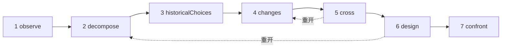

# 研究

研究是一位 AI 研究员。它运用一种方法——**先理解一个对象，再用今天的手段重新设计它**——并交给你一份档案：这个对象做什么、如何运作、为什么当初要那样构建、此后发生了哪些变化、几种新的设计，以及能在它们之间做出裁决的实验。它不构建任何东西，不运行任何东西，也不测量任何东西：它只做调查和提议。

::: tip 通俗地说
挑一个对象：Web 浏览器、数据库引擎、列车时刻表。研究会观察它、拆解它，寻找它过去那些选择背后的原因，搜索此后出现的研究成果和技术，再把两者交叉对照，设想另一种组织方式。它追求的是一种原理上的改变，让某种新的东西成为可能，而不是同一个东西的更快版本。每一条论断都会说明自己是由研究实际找到的来源**确立**的、只是一个**假设**，还是一个仍需对照现有工作核查的**创新点**。而且自始至终，有好几种机制让它紧扣你给定的目标，因为随着指令不断累积，语言模型往往会跑题。每个术语都在[关键术语通俗解释](./glossary#studies)中有说明。
:::

```ts
const study = sdk.createStudy({
  name: 'browser',
  object: 'The Web browser, from 1990 to 2026',
  objective: 'A browser design whose every choice follows from the investigation',
  leads: ['vectorisation', 'weights', 'ReLU'], // your leads: examples to verify, not truths
  analogues: ['Bitcoin'],                      // breakthroughs by assembly to deconstruct
  sources: ['brave_web_search'],               // SDK tools the study searches with
});

const result = await study.run();
result.status;   // 'completed' | 'stopped' | 'failed' | 'cancelled'
result.report;   // the structured report
result.markdown; // the same, as a readable dossier
```

## 什么是研究 {#what-a-study-is}

研究分七个环节运用一种方法：*先理解一个对象，再用今天的知识和技术重新设计它*。它的指导性问题是：**如果必须用今天可用的知识和技术来满足今天的需求，我们会如何组织这个对象？** 除非你给出自己的 `question`，研究会用它的语言提出这个问题，后面接着[追求：一种新能力](#the-aim-a-new-capability)一节所描述的追求。

研究不是智能体。它没有可以用来行动的工具，只有可供搜索的**来源**（参见[通过你的来源开展研究](#research-through-your-sources)），它的产出是一份报告，而不是一个动作。它用 `sdk.createStudy()` 创建，依据的是一份**章程**——对象、目标、你的需求和你的线索——章程此后永不改变。

它的最后一个环节设计实验，但不运行实验。你运行了某个实验之后，就把它的发现记录到对应的机制卡片上（参见[机制卡片](#the-mechanism-card)）。

## 七个环节 {#the-seven-passages}

一次运行按顺序经历方法的七个环节。每个环节产出几类条目（它的**集合**），每个条目都有一个永不重复使用的 id：`O1`、`P2`、`A1`……

| # | 环节 | 做什么 | 保留什么 |
| --- | --- | --- | --- |
| 1 | `observe` | 观察对象的行为、用途、变体和故障，每一项都附上它的条件：何时、何地、对谁、借助什么。它只描述，还不解释 | `observations`（`O`） |
| 2 | `decompose` | 梳理各个部件：它们的功能、输入、输出和相互关系；只要某个部件的工作方式仍不透明，就深入到它的内部，并列出每个部件的未知项。按阶段界定对象的**完整链条**（对浏览器而言：接收、理解、执行、显示、交互） | `pieces`（`P`）、`chain`（`C`） |
| 3 | `historicalChoices` | 搜索当时那些选择有据可查的原因：硬件、工具、用途、知识、成本、兼容性。没有文献支持的合理原因仍然只是假设 | `historicalChoices`（`H`） |
| 4 | `changes` | 搜索此后出现或变得可用的东西，无论是在对象所属的领域还是在其他领域，每一项进展都附上它的机制、日期、证据、使用条件和可获得性。对你的每条线索给出判定，在它们之外寻找其他数学和技术工具，列出当前最好的实现（衡量“更好”的参照），并拆解组装式突破 | `advances`（`V`）、`leadVerdicts`（`L`）、`independentLeads`（`I`）、`references`（`R`）、`analogues`（`B`） |
| 5 | `cross` | 把过去与现在交叉对照：哪些约束依然存在，哪些已经减弱，哪些要求是新出现的。由此推出哪些决策已经可以修订，提出 A + B 的组合（A 让 B 能做什么，它们必须交换什么，这在转换和同步上要付出什么代价），并提出候选的新能力 | `constraints`（`K`）、`revisableDecisions`（`D`）、`combinations`（`X`）、`capabilities`（`Y`） |
| 6 | `design` | 设计至少两种架构，其中至少一种以新能力为目标，每一种都覆盖完整链条，并给出它的机制、条件、收益、额外成本、一个可能的反例和它的预测。给出每个主要部件的三种状态，并说明哪些是新的、哪些不是。然后搜索这些创新点的现有技术 | `architectures`（`A`）、`threeStates`（`T`）、`noveltyClaims`（`N`） |
| 7 | `confront` | 设计能在各架构之间做出裁决、并检验完整链条的实验：实验方案、测量指标、判据，以及每种架构的预期结果。为每个主要机制填写一张机制卡片 | `experiments`（`E`）、`cards`（`M`） |

搜索返回的结果也会编号：`S1`、`S2`……每个环节会以紧凑的 JSON 记录的形式，收到它所需要的较早环节的条目。

### 是循环，而不是直线 {#a-loop-not-a-line}



这些环节构成一个循环。当一个未知项阻碍了某个环节时——比如设计需要知道某个部件实际上是如何工作的——它可以要求就这一点**重开**一个较早的环节。较早的环节会围绕这个焦点再运行一次，在原有条目之外添加新的条目，然后提出请求的环节带着这些条目再运行一次。`limits.maxLoops` 限定一次运行中重开的次数（默认为 1，设为 0 则不允许重开）；本身被重开过的环节不能再重开其他环节。

### 每个部件的三种状态 {#three-states-of-each-piece}

设计会为每个主要部件给出三种状态，在报告中分开保存（`threeStates`）：

- **当时的对象**（`atItsTime`）：这个部件当初是如何构建的，在什么条件下构建；
- **当前最好的相关实现**（`currentBest`）：衡量一项改进所依据的参照；
- **我们的提议**（`proposal`）：架构如何处理这个部件。

一个选择年代久远，并不会让它变成错的，而一项新近的技术可以让过去的某种复杂设计变得不再必要：三种状态揭示了哪个条件改变了，哪种机制变得可行，以及这对整体意味着什么。

### 机制卡片 {#the-mechanism-card}

最后一个环节为每个主要机制填写一张卡片。卡片有十一个字段：研究填写前九个，最后两个会一直空着，直到你运行了某个实验。

| # | 字段 | 它回答的问题 |
| --- | --- | --- |
| 1 | `observation` | 系统做什么，在什么条件下？ |
| 2 | `mechanism` | 哪些部件和关系能解释它？ |
| 3 | `unknown` | 还有什么有待打开、测量或记录？ |
| 4 | `historicalChoice` | 为什么选择了这种组织方式，依据是什么？ |
| 5 | `evolution` | 此后发生了哪些变化，有哪些来源和日期？ |
| 6 | `newPossibility` | 得益于这一变化，哪个选择变得可以修订？ |
| 7 | `proposedCombination` | 这些技术具体如何配合在一起？ |
| 8 | `prediction` | 我们预期会有什么效果，在什么条件下？ |
| 9 | `experiment` | 我们如何在各种提议之间做出裁决，并检验整体？ |
| 10 | `resultAndError` | 我们发现了什么，解释在哪里失效？ |
| 11 | `conclusionAndMemory` | 我们保留什么，改变什么，这个机制还能在哪里复用？ |

```ts
await study.recordResult('M1', {
  result: 'Layout reuse cut the time to redraw by 40% on the reference pages',
  error: 'No gain on pages whose styles change on every frame',
  conclusion: 'Keep immutable layout results; look again at style invalidation',
});
```

`recordResult(cardId, { result, error?, conclusion? })` 填写卡片的第 10 和第 11 个字段，并在写出这张卡片的那次运行中记录一个 `study.result_recorded` 事件。对于未知的卡片或空的 `result`，它会抛出 `ValidationError`。`study.report()` 返回已填好这张卡片的报告。

## 追求：一种新能力 {#the-aim-a-new-capability}

研究寻找的不是同一个对象的更快版本。它寻找的是**一种原理上的改变，让今天难以做到的事情成为可能，而不只是让某件事更快**。

### 能力、原理、机制 {#capability-principle-mechanism}

每种架构都要陈述三件事：

- **能力**（`capability`）：什么变得可能，对谁而言，以及它解除了今天的哪项约束（`what`、`forWhom`、`liftedConstraint`）；
- **原理的改变**（`principleChange`）：哪项原理发生了改变——`representation`、`distribution`（工作的分配）、`responsibility`、`trust`、`verification` 或 `other`——以及如何改变；
- **机制**（`mechanism`）：技术的组装如何产生这项能力。

每种架构都声明自己的 `kind`：`capability`，或者当它只是让某件事更快或更便宜时为 `improvement`。没有声明类别的架构算作改进，即较弱的主张。能力必须陈述它的原理改变和它的组装方式，否则 schema 会拒绝它（参见[每个条目都说明它服务于什么](#every-item-says-what-it-serves)）。

你可以在章程中写明你所追求的能力（`capability`）；此后每个 prompt 都会带上它。如果没有写明，`cross` 环节就必须至少提出一个候选能力（`capabilities`，`Y1`……），说明它为谁服务、为什么今天很难做到，以及哪项原理会改变。

守护者（参见[守护者](#the-guardian)）也会评判每种架构：被它认为只是更快或更便宜的能力会变成 `improvement`，并用 `declaredKind: 'capability'` 表明模型当初的主张。完全没有能力的设计整体上偏离了目标：它会被记入偏离日志并重做一次；如果重做后仍然没有，报告会指出这一点（提示 `noCapability`）。在报告中，**能力在前，改进在后**。

### 新意在于组装 {#novelty-lies-in-the-assembly}

突破很少来自一项前所未有的技术。更常见的是，它们以一种前人没有用过的方式把已有的技术组装起来，而这种组装开启了一项能力。研究也按同样的方式推理：

- 架构列出它的**组件**（`components`）：已有的技术，每一项都有它的陈述、日期和来源，每一项的状态都像任何论断的状态一样接受检查；
- 它的**组装**（`assembly`）说明每个组件给其他组件提供了什么、它们交换什么，以及代价是什么；
- 组件**从来不是创新点**：被说成是新的组件，如果研究检索到的某个结果记录了它，就是 `established`，否则就是 `hypothesis`，并附上原因；
- 架构自身的状态就是它的组装和它的能力的状态。当它声称有创新点时，它的现有技术会**作为一个组合**来搜索：研究寻找的是已经把同样的组件结合起来、产生同样能力的工作，而不是逐个查找每一部分。

档案展示每种架构的路径：组件（及其状态）→ 组装（及其状态）→ 能力。

### 组装式突破 {#breakthroughs-by-assembly}

`changes` 环节还会拆解过去任何领域中来自已有技术组装的突破（`analogues`，`B1`……）。比特币是方法给出的例子：公钥签名、哈希链和时间戳、工作量证明、Merkle 树以及点对点网络此前都已存在；把它们组装起来，就得到了一个无需受信任第三方的共享账本。

对于每项突破，研究都会记录它所组装的已有技术（至少两项，附上日期）、它解除的约束、由此开启的能力，以及这种组装的**模式**。`cross` 和 `design` 环节会收到这些模式，并可以复用它们。每项突破都和其他论断一样是一条论断：只有在有研究检索到的结果支持时，它才是 `established`。

你在 `analogues` 中点名的每项突破都必须被拆解。遗漏了其中某一项的回复会被退回一次；如果仍有遗漏，报告会把它列在 `undeconstructedAnalogues` 中，并给出提示 `analoguesNotDeconstructed`。研究还可以加上它找到的其他突破。

## 已确立、假设、创新点 {#established-hypothesis-novelty}

研究的每个条目都是一条**论断**：一个带有状态的陈述，附有它引用的结果（`sources`），以及它在目标中服务于什么。状态由模型提出；**由代码检查**，无论模型怎么说。

| 状态 | 它要求什么 | 否则研究会怎么做 |
| --- | --- | --- |
| `established` | 它至少引用一个**本研究从其来源中检索到**的结果 | 它会变成 `hypothesis`。`declaredStatus` 保留模型给出的状态，`statusReason` 说明原因；它引用了、但研究从未检索到的 id 会被单独放在 `unretrievedSources` 中，不能支持任何东西 |
| `hypothesis` | 无：合理，但在这里没有文献依据 | — |
| `novelty` | 一个尚不存在的想法，以及一次**对其现有技术的搜索** | 它仍然是一个有待核查的创新点（`toVerify: true`），并附上原因，直到它的现有技术被搜索和评估过为止 |

研究无法读懂的状态按 `hypothesis` 计算，绝不会按更强的状态计算。**没有来源，就什么也无法确立**：每条论断最多只是假设，任何创新点都无法核查，报告会在它的第一条提示中说明这一点（`noSources`）。

### 现有技术 {#prior-art}

设计完成之后，研究会搜索每个仍有待核查的创新点的现有技术，无论它来自设计还是来自较早的环节。搜索由模型选择（对于一种架构：它的组件组合加上它的能力），由研究执行，然后另一次独立的调用会在结果中指出最接近的现有工作，并给出判定：

- `novel` 或 `partlyNovel`：论断仍然是创新点，不再需要核查，并附有它的 `priorArt`（`closest`、`sources`、`verdict`）；
- `exists`：这个想法已经有人做过；论断变成 `hypothesis`，`statusReason` 会指出最接近的工作。

如果一个创新点的现有技术无法被搜索或评估——没有来源、搜索预算已经用完、没有为它请求搜索，或者它是在设计之后才被提出的——它就仍然有待核查，并说明原因。报告会统计这些创新点（提示 `noveltiesToVerify`）。

## 通过你的来源开展研究 {#research-through-your-sources}

SDK 没有内置的 Web 搜索。研究使用**你交给它的工具**作为 `sources` 来搜索：SDK 工具的名称，通常是用 [`connectMcpServer`](./mcp#use-the-tools-of-an-mcp-server-in-your-agents) 导入、再用 `sdk.defineTool` 定义的某个 MCP 服务器的搜索工具：

```ts
import { connectMcpServer } from '@sdk-ai-agents/core/mcp';

const search = await connectMcpServer({
  name: 'search',
  transport: {
    type: 'stdio',
    command: 'npx',
    args: ['-y', '@modelcontextprotocol/server-brave-search'],
    env: { BRAVE_API_KEY: process.env.BRAVE_API_KEY ?? '' },
  },
  metadata: { readOnly: true },
});
// Define the tools first: the study checks its sources when it is created.
const sources = search.tools.map((tool) => sdk.defineTool(tool).name);

const study = sdk.createStudy({ name: 'browser', object, objective, sources });
```

- **在创建研究时检查。** 如果某个来源不是已定义的工具，或者不接受文本查询，`createStudy` 会抛出 `ValidationError`。查询放在工具的 `query` 参数中，或者放在另一个常见名称的参数中（`q`、`search`、`keywords`……），否则放在它唯一必需的文本参数中，再否则放在它的第一个文本参数中。
- **受治理。** 每次搜索都通过 `sdk.executeTool` 执行，以研究的 `id` 作为智能体 id，并且只允许使用这些来源：允许列表、策略、预算、审批、重试和追踪记录都像对任何工具调用一样适用，工具事件（`action.executing`、`policy.checked`、`tool.called`、`action.executed`）会记录在研究的运行中。失败的搜索，或者被策略拒绝的搜索，会连同它的错误一起被记录下来，研究继续进行。
- **何时搜索。** 在 `historicalChoices` 之前和 `changes` 之前，模型会请求该环节所需的搜索——对于 `changes`：核实你的每条线索，在它们之外寻找其他工具，找出当前最好的实现，以及为组装式突破寻找文献依据。在 `design` 之后，它会搜索各创新点的现有技术。一次最多请求六次搜索。
- **编号的结果。** 无论结果是什么形状（列表；包含列表的对象，例如 `results` 或 `items`；JSON 文本；MCP 文本部分；纯文本），研究都能读取。它会保留标题、URL 或其他定位符、给出时的日期以及一段摘录，并在整个研究范围内只编号一次：再次找到的同一个结果（按其定位符判断）保留原来的 id。每次搜索它保留 `limits.maxResultsPerSearch` 个结果（默认 5 个）。
- **有上限。** `limits.maxSearches`（默认每次运行 20 次）限制搜索的次数。一旦用完，运行**并不会停止**：它会在不搜索的情况下继续，需要来源的论断仍然是假设，创新点仍然有待核查，报告会说明哪些环节无法搜索（提示 `searchesSkipped`）。

你的线索是有待核实的例子，而不是真理：`changes` 必须对每一条给出判定——`relevant`、`partlyRelevant` 或 `notRelevant`，并附上理由——遗漏了某一条的回复会被退回一次。仍然没有判定的线索会被列在 `unverifiedLeads` 中（提示 `leadsNotVerified`）。研究自己找到的工具是 `independentLeads`。

## 紧扣目标 {#staying-on-the-objective}

语言模型会偏离。每加一条指令，主题就会再走偏一点，模型会忘记它原本要做什么，直到每次都得提醒它。研究让偏离在**结构上难以发生**，而一旦还是发生了，也**看得见**。

### 冻结的章程 {#a-frozen-charter}

章程包含对象、指导性问题、目标、需求、你的线索、超出范围的内容（`scope.exclude`）、所追求的能力，以及要拆解的突破。它在研究创建时被冻结——`study.charter` 无法被修改，即使是无意中也不行——并用 SHA-256 计算哈希（`study.charterHash`）。每次运行开始时（`study.started`）以及每一条修正案中都会记录这个哈希，因此你可以证明每次运行都是基于同一份章程进行的。研究的 `name` 不属于章程：章程相同的两项研究，哈希也相同。**新的目标就是一项新的研究。**

### 每次调用都重建的 prompt {#a-prompt-rebuilt-at-each-call}

研究从不维持一段对话。每一次模型调用都只由以下内容构建：

- 章程，以及位于其下的已接受的修正案；
- 该环节的任务；
- 它需要的、来自较早环节的紧凑记录（JSON，而不是对话记录）；
- 它可以引用的搜索结果。

没有任何较早的回复会进入 prompt。即使是修复一条无法使用的回复，也是根据章程重新构建的：它说明这条回复为什么被拒绝，但从不说明回复的内容。调用与调用之间没有任何累积，所以没有任何东西会冲淡目标。

### 首尾都是目标 {#the-objective-at-both-ends}

每个 prompt 都以章程开头，并以一段提醒结尾，提醒的最后一行就是目标：

```text
STUDY CHARTER (immutable, sha256 3f5a9c0e1b2d4f67)
Object: The Web browser, from 1990 to 2026
Question: If we had to meet today’s needs with the knowledge and techniques available today, how would we organise this object? Which change of principle would make possible something difficult today, not only faster?
Objective: A browser design whose every choice follows from the investigation
…
Accepted amendments (subordinate to the objective):
1. Examine memory safety too

(the task of the passage, the records of earlier passages, the results it may cite)

REMINDER
This step must produce: at least two architectures, at least one aiming at a new capability, …
Out of scope: anything that serves neither the objective nor the needs.
Write every text value in English (en). Reply with the JSON object only.
Objective: A browser design whose every choice follows from the investigation
```

章程（包括目标）是模型读到的第一样东西，而目标是它读到的最后一样东西。

### 每个条目都说明它服务于什么 {#every-item-says-what-it-serves}

每个条目都必须带有 `servesObjective`：用一句话说明它服务于目标的哪一部分，或者哪项需求。缺少它的条目在守护者看到之前就会**被 schema 拒绝**，并记入偏离日志（`by: 'schema'`）。说不出自己服务于什么的条目，通常就是什么也不服务的条目。

### 守护者 {#the-guardian}

每个环节结束后，会有一次独立的调用——**守护者**——它只看到章程、已接受的修正案和该环节的条目：看不到任务，看不到较早的记录，也看不到搜索。它以温度 0 运行，并逐条评判：是否紧扣目标，以及原因。对于设计，它还会评判每种架构是否开启了一项新能力（参见[能力、原理、机制](#capability-principle-mechanism)）。

- 偏离目标的条目会被移除，并连同原因记入**偏离日志**（`by: 'guardian'`），同时记录为一个 `study.drift_rejected` 事件。
- 当被拒绝的条目（被守护者或被 schema 拒绝）超过该环节产出的一定比例——`driftThreshold`，默认为三分之一——该环节会**重做一次**，并被告知哪些条目被拒绝了以及原因。重做得到的条目取代第一次尝试的条目。
- 报告保留每一次拒绝（`driftLog`），并在 `stats` 中统计拒绝和重做的次数。

### 修正案 {#amendments}

你可以在研究创建之后添加一条指令。它永远不会在无人察觉的情况下混进来：守护者会在一次单独的运行中，对照章程对它进行分类。

```ts
const amendment = await study.amend('Examine memory safety too');
amendment.verdict;  // 'refines' | 'conflicts' | 'changesObjective' | 'unclassified'
amendment.accepted; // true only when it refines the objective
amendment.number;   // 1, 2… for an accepted amendment
amendment.reason;   // why
```

| 判定 | 含义 | 结果 |
| --- | --- | --- |
| `refines` | 它在目标和范围之内细化或收窄工作，或者增加一项需求 | 被接受、编号，并显示在此后每个 prompt 中的章程下方——包括正在进行的运行的 prompt |
| `conflicts` | 它与章程、范围或某条已接受的修正案相矛盾 | 被拒绝，并附上原因；它永远不会进入 prompt |
| `changesObjective` | 它改变了对象或目标 | 被拒绝：新的目标就是一项新的研究，要用 `sdk.createStudy` 创建 |
| `unclassified` | 对它的分类失败了 | 被拒绝：目标优先 |

被接受和被拒绝的修正案都会被记录（`study.amendment_accepted`、`study.amendment_refused`），并列在 `study.amendments` 和报告中。指令从不会悄无声息地累积：每一条都有编号，从属于目标，并且看得见。

### 为什么这样有效 {#why-this-works}

偏离来自不断增长的上下文：较早的回答、层层叠加的指令和旁枝末节的讨论，最终会比目标更有分量。研究消除了这种增长。模型从不重读自己较早的回复，所以不会被自己的偏离带着走。指令不会累积：只存在已接受的修正案，每一条都有编号，并从属于一份无法改变的章程。章程打开每个 prompt，目标结束每个 prompt，这正是模型最关注的位置。每个条目都必须对照目标证明自己的价值，这让跑题的条目很容易被发现。而一个视野狭窄的裁判——只看章程和条目，别无其他——会抓住仍然溜过去的东西，同时偏离日志会告诉你它移除了什么以及原因。

这一切都不能让偏离变得不可能：守护者也是一个模型，在两个方向上都可能出错。它让偏离变得不太可能、有边界（每个环节最多重做一次）并且可审计。

## 限制、成本与预算 {#limits-costs-and-budgets}

| 限制 | 默认值 | 达到时 |
| --- | --- | --- |
| `maxModelCalls` | 60 | 运行停止：状态为 `stopped`，`stoppedBy: 'maxModelCalls'`。它统计这次运行的每一次调用：环节、搜索请求、守护者检查、现有技术检查、修复 |
| `timeoutMs` | 20 分钟 | 运行被中止，进行中的调用会收到中止信号：`stopped`，`stoppedBy: 'timeoutMs'` |
| `maxSearches` | 20 | 运行在不搜索的情况下继续（参见[通过你的来源开展研究](#research-through-your-sources)） |
| `maxLoops` | 1 | 不再提供重开 |
| `maxResultsPerSearch` | 5 | 一次搜索的其余结果被丢弃 |

这些限制适用于每一次运行。其他设置：`driftThreshold`（1/3）、环节和搜索请求的 `temperature`（0.4；守护者、修正案和现有技术检查以 0 运行）、`maxTokens`、`model`（省略时使用提供商的默认模型）以及 `llmProvider`（为这项研究使用的提供商，代替 SDK 的提供商）。超出范围的配置会在创建研究时抛出 `ValidationError`。

停止的运行**保留它已经完成的一切**：已经完成的环节、进行中环节的条目（守护者还没有评判的条目会被标记为 `unchecked`，提示 `uncheckedItems`），以及一份说明哪些没有运行的报告和档案。

一次没有修复和重做的运行，在没有来源时进行 14 次模型调用——每个环节及其守护者检查——有来源时最多 18 次：在 `historicalChoices` 和 `changes` 之前请求的搜索，以及对创新点的现有技术搜索（先是它的查询，再是它的检查）。每次修复增加一次调用，每次重做至少增加两次（再次执行该环节及其检查），每次重开至少增加四次（被重开的环节和提出请求的环节，各自带着检查）。

### 成本与预算 {#costs-and-budgets}

研究的每一次模型调用都会记录为一个 `study.model_called` 事件，带有它的 `model`、`requestedModel` 和 `usage`——一次调用及其修复记为一个事件——而提供商丢弃的应答记录为一个 `provider.answer_discarded` 事件。它们像任何其他模型调用一样被计数：

- 计入 `sdk.getRunCost(result.runId)`，修正案则计入它自己的运行：`sdk.getRunCost(amendment.runId)`（参见 [API 成本](./costs)）；
- 计入按周期的预算，归在研究的 `id` 名下：`sdk.getBudgetUsage({ agentId: study.id, period: 'all' })` 给出它所有运行的 token 数、成本和工具调用次数。

SDK 的预算和超时策略（`defaultPolicies`、`defineGlobalPolicy`）会在**每个环节之前**检查，就像认知智能体在每一步之前检查一样（参见[限制与策略](./cognitive-agents#limits-and-policies)）：`maxSteps` 统计已经执行的环节，`maxTokens` 统计这次运行的模型调用的 token 数，`maxDuration` 统计自运行开始以来的时间，而带 `maxTokens` 或 `maxCost` 的 `budgetLimit` 统计它按周期的预算。拒绝的策略会记录带有 `passage` 的 `policy.violated`，运行随即停止：`stopped`，`stoppedBy: 'policy'`。搜索作为工具调用，同样要经过这些策略。

## 运行、恢复与取消 {#runs-resume-and-cancellation}

| 状态 | 何时 | 最后的事件 |
| --- | --- | --- |
| `completed` | 每个环节都运行了 | `study.completed`、`run.completed` |
| `stopped` | 某个限制或策略结束了运行（`stoppedBy`） | `study.failed`、`run.failed` |
| `failed` | 某个错误结束了运行，例如一条即使修复后仍无法使用的回复，或者一个有效架构少于两种的设计（`error`） | `study.failed`、`run.failed` |
| `cancelled` | 它的 `signal` 被中止 | `study.failed`、`run.cancelled` |

```ts
const controller = new AbortController();
const first = await study.run({ signal: controller.signal });

// Later: resume at the first passage not complete, with what was done kept.
const second = await study.run();

// Or run every passage again.
const fresh = await study.run({ restart: true });
```

- **恢复。** `run()` 从第一个尚未完成的环节开始，所以停止、失败或取消的运行可以通过再次调用 `run()` 来恢复。已经完成的环节会被保留；`study.started` 记录运行从哪里恢复（`resumeAt`）。`restart: true` 会重新运行每个环节（id 从原来的位置接着编号：`O3` 接在 `O2` 之后）。
- **一次只能有一个运行。** 在一次运行进行期间再调用 `run()` 会抛出 `ValidationError`。运行期间可以调用 `amend()`。
- **在内存中。** 研究的状态保存在它的 `Study` 对象中，它的 `id` 在每个进程中都不同：恢复要在同一个对象上进行。事件记录了每个环节的条目、每次搜索和每个判定，以供审计，但 SDK 不会根据它们重建一项研究。
- **报告。** `result.report` 是运行结束时的一份副本；`study.report()` 返回报告当前的样子，包括此后记录的结果。

### 实时事件 {#live-events}

`run({ onEvent })` 会按顺序、在事件存储接受每个事件之后，用这次运行的每一个事件调用你的监听器，与 `agent.run` 完全一样（参见[实时进度](./observability#live-progress)）。`run()` 会在监听器处理完每一个事件之后返回，而当运行被取消或超时时会更早返回。

```ts
const result = await study.run({
  onEvent: (event) => {
    if (event.type === 'study.passage_started') console.log(`→ ${event.data.passage}`);
    if (event.type === 'study.drift_rejected') console.log(`  off the objective: ${event.data.reason}`);
  },
});

// Every run of the study, amendments included: its events carry its id as agentId.
const unsubscribe = sdk.subscribe(listener, { agentId: study.id });
```

研究记录十一种事件类型：`study.started`、`study.passage_started`、`study.passage_completed`、`study.search`、`study.model_called`、`study.drift_rejected`、`study.amendment_accepted`、`study.amendment_refused`、`study.result_recorded`、`study.completed` 和 `study.failed`。[事件目录](../reference/events#studies)给出了它们的数据。

## 一个完整的示例 {#a-complete-example}

`examples/study.ts` 用法语研究 1990 年到 2026 年的 Web 浏览器。它给出三条有待核实的线索——向量化、权重（`poids`）和 ReLU，没有任何依据表明这些例子适用于浏览器——没有指明任何能力，因此由研究提出候选能力；它还要求研究把比特币作为组装式突破来拆解。它的核心部分如下，以 Brave 搜索服务器作为来源：

```ts
import { writeFileSync } from 'node:fs';
import { FileEventStore, createSDK } from '@sdk-ai-agents/core';
import { connectMcpServer } from '@sdk-ai-agents/core/mcp';

const eventStore = new FileEventStore('./events');
const sdk = createSDK({
  apiKey: process.env.OPENAI_API_KEY,
  eventStore,
  // Illustrative prices: use your provider's current prices or your contract.
  pricing: { 'gpt-4o': { inputPerMillion: 2.5, outputPerMillion: 10 } },
});

// The study searches only with the tools you give it, run through the governed pipeline.
const search = await connectMcpServer({
  name: 'search',
  transport: {
    type: 'stdio',
    command: 'npx',
    args: ['-y', '@modelcontextprotocol/server-brave-search'],
    env: { BRAVE_API_KEY: process.env.BRAVE_API_KEY ?? '' },
  },
  metadata: { readOnly: true },
});
const sources = search.tools.map((tool) => sdk.defineTool(tool).name);

const study = sdk.createStudy({
  name: 'navigateur',
  object: 'Le navigateur Web, de 1990 à 2026',
  objective: "Une conception de navigateur dont chaque choix découle de l'enquête",
  needs: ['interactions', 'accessibilité', 'compatibilité attendue avec le Web existant'],
  leads: ['vectorisation', 'poids', 'ReLU'],
  // No capability named: the study proposes candidates (set `capability` to aim at one).
  analogues: ['Bitcoin'],
  sources,
  model: 'gpt-4o',
  language: 'fr',
  limits: { maxModelCalls: 60, maxSearches: 20, timeoutMs: 20 * 60_000 },
});

const result = await study.run({
  onEvent: (event) => {
    if (event.type === 'study.passage_started') console.log(`→ ${event.data.passage}`);
    if (event.type === 'study.search') console.log(`  search: ${event.data.query}`);
  },
});

writeFileSync('study-navigateur.md', result.markdown);
const { stats } = result.report;
console.log(`${result.status}: ${stats.byStatus.established} established, ${stats.byStatus.hypothesis} hypotheses`);
// Capabilities first, then improvements (only faster or cheaper).
for (const { id, kind, name, capability } of result.report.architectures) {
  console.log(`${id} [${kind}] ${name}: ${capability.what}`);
}
console.log(await sdk.getRunCost(result.runId));

await search.close();
await eventStore.destroy();
```

这个示例本身接受任何 MCP 搜索服务器的命令：用 `OPENAI_API_KEY=… SEARCH_MCP="npx -y @modelcontextprotocol/server-brave-search" BRAVE_API_KEY=… npm run example:study` 运行它（`SEARCH_TOOLS` 选择服务器的部分工具，`MODEL` 选择模型）。它把档案写入 `examples/study-navigateur.md`。没有 `SEARCH_MCP` 时，它在没有来源的情况下运行：一切都仍然是假设，档案会首先说明这一点。

档案中可以看到：

- **被评判的线索**：向量化、权重和 ReLU 各自得到一个附带理由的判定，研究还会列出它在这些线索之外找到的其他工具；
- **被拆解的比特币**：它先前已有的组件及其日期、它解除的约束（受信任的第三方）、由此开启的能力，以及组装模式，交叉环节和设计环节会复用这一模式；
- 交叉环节下的**候选能力**，然后是至少两种浏览器架构，能力在前，每一种都有它的“组件 → 组装 → 能力”路径、它对完整链条（接收、理解、执行、显示、交互）的覆盖以及它的预测；
- 能在它们之间做出裁决的**实验**，以及机制卡片，其第 10 和第 11 个字段在你运行实验之后填写。

## 阅读报告 {#reading-the-report}

```ts
const { report } = result;
report.notices;       // read first: no sources, a stop, leads without a verdict…
report.architectures; // capabilities first, then improvements
report.experiments;   // what would decide between the architectures
report.cards;         // one mechanism card per main mechanism
report.driftLog;      // what left the objective, and why
report.results;       // every result retrieved, S1, S2…
report.stats;         // model calls, searches, items by status, rejections, redos, loops
```

报告还包含章程及其哈希、修正案、每个环节的状态（`complete`、`partial`、`unchecked` 或 `notRun`，以及它的尝试次数和重开过它的环节）、各环节的每一个集合、按部件分组的三种状态、搜索，以及研究的各次运行（`runIds`，包括修正案的运行）。[SDK API 参考](../reference/sdk-api#studies)列出了它的类型。

**提示**说明了读者在信任其余内容之前必须知道的东西：

| 代码 | 含义 |
| --- | --- |
| `noSources` | 研究没有任何来源：什么也无法确立，也无法核查任何创新点 |
| `stopped`、`failed`、`cancelled` | 最后一次运行是如何结束的；报告保留已经完成的内容 |
| `passagesNotRun` | 最后一次运行没有到达的环节 |
| `uncheckedItems` | 守护者没有评判的条目，因为运行先停止了 |
| `searchesSkipped` | 搜索预算用完了，以及是在哪些环节 |
| `leadsNotVerified` | 没有判定的线索 |
| `analoguesNotDeconstructed` | 点名了但没有被拆解的突破 |
| `noCapability` | 没有任何架构以新能力为目标：只有改进 |
| `noveltiesToVerify` | 仍需对照现有技术核查的创新点 |

### 档案 {#the-dossier}

`result.markdown` 是以可读档案形式呈现的报告，使用研究的 `language`。`renderStudyMarkdown(report)` 可以根据任何报告写出同样的档案——例如在你记录了一个结果之后调用 `renderStudyMarkdown(study.report())`。它遵循方法的顺序：

1. 章程（对象、问题、目标、需求、线索、范围、所追求的能力、要拆解的突破、哈希）以及修正案；
2. 提示；
3. 方法的原理，以及每个环节的状态；
4. 每个环节的条目：观测、部件和完整链条、历史选择、进展、线索判定、独立线索、当前参照、约束、可修订的决策和候选能力；
5. 每个部件的三种状态、组合，以及组装式突破；
6. 设计思路：每种架构都标明是新能力还是改进，并附有它为谁服务、解除的约束、原理的改变、机制、“组件 → 组装 → 能力”路径、它的条件、收益、额外成本、反例、链条覆盖情况和预测；然后是哪些是新的、哪些不是；
7. 实验，以及机制卡片；
8. 偏离日志、来源和统计数据。

每条论断都会显示它的状态和它引用的结果（`S1, S3`）；被研究降级的状态会说明模型当初声明了什么以及原因；创新点会显示它的现有技术，或者说明它仍有待核查。档案中的用语有本文档的十一种语言版本；其他语言会得到英文标签，但模型仍然用那种语言撰写它的文本。报告中每条提示的 `message` 是英文的；档案会用它自己的语言写出这条提示。

## 研究不做什么 {#what-a-study-does-not-do}

- **它不构建、不运行、也不测量任何东西。** 在你运行实验之前，它的预测都只是预测。
- **它只知道它的来源返回的东西。** SDK 自己没有 Web 搜索；没有来源时，每条论断都是假设。
- **检查的是引用，而不是引用的内容。** 代码检查的是 `established` 论断所引用的结果确实由本研究检索到，而不是这个结果说的就是论断所说的内容。档案列出了每个来源及其链接：请去阅读它们。
- **守护者和现有技术检查都是模型的判断。** 偏离日志和现有技术说明会展示这些判断，所以你可以不同意。
- **它读取的内容是不可信的。** 搜索结果中可能包含针对模型的指令（prompt 注入）。研究只能调用它的来源，而且要经过策略；模型和来源的文本在档案中都会被转义；状态和偏离规则由代码强制执行，而不是靠 prompt。
