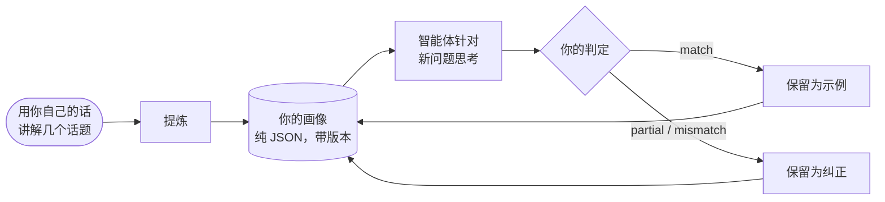

# 思考者画像：像特定的人一样推理

::: tip SDK 能像我一样推理吗？
**能：它可以模仿某个特定的人推理的方式。** 认知智能体可以遵循*你的*关注顺序，权衡*你的*优先事项，运用*你的*思维习惯，并否决*你*会否决的东西。它从你用自己的话讲解的几个问题中学会这些；每当你告诉它哪里错了，这条纠正就会加进它的指令，而你的认同度会显示它是否越来越接近。

它模仿的是一种**推理方式**，而不是一个人：它不知道你没有写下来的东西，也不会替你做决定。SDK 不会宣称它对你模仿得有多接近：**由你来衡量**，一次又一次运行，用你给它的答案打出的认同度百分比来衡量。
:::

{.illustration}

## “像你一样推理”是什么意思 {#what-reasoning-like-you-means}

| 它会模仿 | 它不会模仿 |
| --- | --- |
| 你审视问题的**顺序**（先看它真正能实现什么，再看它的局限……） | 你的**知识**：你知道但从未写下来的东西，除非你把它作为上下文或观测提供 |
| 你的**优先事项**（对你来说最重要的东西，按顺序排列） | 你的**记忆**和你的人生：它只知道你给它的样本、纠正和上下文 |
| 你的**思维习惯**（“当一项服务收费时，我会先找免费的替代品”） | 你从未诉诸语言的直觉 |
| 让你**否决**一个想法的东西 | 你的**责任**：它的答案是对你会怎么想的预测，而不是替你做出的决定 |
| 你的**风险偏好** | 你对世界的确信：和任何认知智能体一样，论断仍然需要证据 |
| 你**纠正过的错误**：它会被告知不要重犯 | |

## 它如何运作，一步一步来 {#how-it-works-step-by-step}



### 第 1 步：用你自己的话讲解几个话题 {#step-1-explain-a-few-topics-in-your-own-words}

一个**样本**就是你推理过的一个话题，按它在你脑中出现的样子写下来。写得凌乱也没关系。它有三个部分：

| 字段 | 写什么 | 示例 |
| --- | --- | --- |
| `topic` | 主题，用几个词概括 | “一个只会收拾厨房的机器人” |
| `reasoning` | 你是怎么着手的：你先看了什么、核实了什么、什么让你犹豫、为什么 | “它到底能做什么？只能处理一个房间，所以局限在于泛化。它能从几个例子中学会另一个房间吗？……” |
| `conclusion` | 你得出的结论或会怎么做（可选，但它会成为一个校准示例） | “构建一个小型的自适应循环，并在第二个房间里测试它” |

在**多样的**话题上写五到十个样本，比在一个话题上写很多样本效果更好：提炼器寻找的是**跨**话题反复出现的东西，只出现过一次的模式是很弱的。

### 第 2 步：提炼你的画像 {#step-2-distill-your-profile}

```ts
const profile = await sdk.distillThinkerProfile({
  id: 'nicolas',
  name: 'Nicolas',
  model: 'gpt-4o',
  samples: [
    {
      topic: 'Typed decision APIs like Jev',
      reasoning:
        'What does it really allow? Then the limits: closed, US-only, paid. Is there an open clone? ' +
        'Could it become the controller of my agents? I would benchmark it on my own traces first.',
      conclusion: 'Use an open clone as the controller and benchmark it against Jev',
    },
    { topic: 'World models', reasoning: 'Structure beats scale. Test on a small chaotic system before anything big.' },
  ],
});
```

具体会发生什么：

1. 检查样本：每个样本都需要一个话题和一段推理。
2. 一次语言模型调用扮演*认知分析师*。它寻找你推理中**反复出现的操作**，而不是你的观点：你先审视什么、你会问哪些问题、你会把一个想法推进到多远、什么让你否决一个方案、你与风险、成本和新颖事物的关系。它被告知只保留样本能够支撑的模式，并优先保留在多个样本中出现的模式。
3. 它的回复会对照画像 schema 进行验证。无效的回复会连同错误被退回一次；第二次失败会抛出 `ThoughtGenerationError`，而不是返回一个半成品画像。
4. 带有结论的样本会作为**示例**保留在画像中，这样画像既包含提取出的方法，也包含它所依据的证据。

结果是纯 JSON。**请阅读它**：如果某个步骤或优先事项错了或漏了，就手动修改。你比任何一次提取都更了解自己。

### 第 3 步：让智能体像你一样思考 {#step-3-let-the-agent-think-as-you}

```ts
const twin = sdk.createCognitiveAgent({
  name: 'my-twin',
  model: 'gpt-4o',
  profile,
  systemPrompt: "Write every statement and the answer in French, in the thinker's own voice.", // optional
});

const run = await twin.think({
  problem: 'A bank offers you a stable, well-paid CTO job maintaining legacy systems. What do you decide?',
});
console.log(run.decision?.status, run.decision?.answer);
```

画像在**运行开始时被复制**，所以运行期间给出的纠正会应用到下一次运行。它被写进每一个推理步骤的指令里，最后的 `decide` 步骤被要求给出*思考者会给出的答案*，其理由要遵循思考者的关注顺序。[画像在哪里起作用](#where-the-profile-weighs-and-where-it-never-does)列出了每一个地方。

### 第 4 步：告诉它哪里错了 {#step-4-tell-it-where-it-went-wrong}

一次运行之后，给出你的**判定**：它的推理方式和你会采用的一样吗？

```ts
// "Yes, exactly what I would have thought."
await twin.learnFromFeedback(run.runId, { verdict: 'match' });

// "No, I would have gone another way."
await twin.learnFromFeedback(run.runId, {
  verdict: 'mismatch',
  expected: 'Prototype with the free clone first, then compare with Jev on 100 real tickets',
  lesson: 'Always test the free option on real data before paying',
});

// "You are 50% right, and here is where you went wrong."
await twin.learnFromFeedback(run.runId, {
  verdict: 'partial',
  agreement: 0.5,
  wrongAbout: ['ignored the free option', 'overestimated the integration cost'],
  expected: 'Benchmark the open clone on our own tickets before deciding',
});
```

| 字段 | 含义 | 是否必需 |
| --- | --- | --- |
| `verdict` | `match`（它推理得和你一样）、`partial`（部分一样）、`mismatch`（完全不一样） | 始终必需 |
| `agreement` | 你认同其中多少，从 0 到 1：`0.8` 表示“对了 80%” | 否 |
| `expected` | 你原本会得出的结论 | `partial` 和 `mismatch` 时必需 |
| `wrongAbout` | 推理在哪里出了错，用你自己的话说 | 否 |
| `lesson` | 下次要记住的规则（默认取 `expected`） | 否 |
| `notes` | 其他任何内容，保存在事件中 | 否 |

它会带来什么影响：

| 判定 | 对画像的影响 |
| --- | --- |
| `match` | 这次运行成为一个校准**示例**：它的问题、推理步骤的摘要以及它的结论。每次 `match` 都会保留最近的 10 个示例，包括提炼出的样本。 |
| `partial` / `mismatch` | 记录一条**纠正**：智能体得出的结论、你预期的结论、你的认同度、它错在哪里以及这条教训。保留最近的 20 条。纠正会放在每个推理步骤指令中画像的末尾，作为最高优先级：“不要重犯这些错误”。Jev 控制器能看到最近的五条教训。 |

每一次判定都会提升画像的补丁版本号（`1.0.0` → `1.0.1`），并作为一个 `cognition.feedback` 事件追加到这次运行中，同时记录修改前后的画像版本。没有决策的运行无法接收反馈：没有可以评判的东西。

`learnFromFeedback` 返回完善后的画像，并把它保留在智能体中。**请保存它**（`twin.getProfile()` 是纯 JSON），否则进程停止时这些教训就丢失了。

### 第 5 步：衡量它有多接近 {#step-5-measure-how-close-it-gets}

SDK 会记录你的判定；它不会给自己打分。要知道它是否真的像你一样推理，请遵循一个简单的流程：

1. 准备一些智能体从未见过的**新问题**，话题要多样。
2. 在阅读智能体的答案之前，**先写下你自己的答案**，这样它的答案就不会影响你的答案。
3. 运行智能体，然后给每个答案打分：`agreement`，它错在哪里（`wrongAbout`），你预期的是什么（`expected`）。
4. 给出这些反馈，并保存完善后的画像。
5. 下一轮使用**另一批新问题**，并把平均认同度与上一轮比较。

如果在它从未见过的问题上平均认同度上升了，这说明它正在掌握你推理的*方式*，而不仅仅是你纠正过的那些答案；不过在少数几个问题上，上升也可能是偶然，所以请坚持做几轮。如果它只在你纠正过的问题上有进步，那它就是在照抄答案。

```ts
const scores = [0.4, 0.6, 0.5]; // the agreement you gave this round
const average = scores.reduce((sum, value) => sum + value, 0) / scores.length; // 0.5, that is 50%
```

## 画像的构成 {#anatomy-of-a-profile}

你也可以手写一份画像：

```ts
import { defineThinkerProfile } from '@sdk-ai-agents/core';

const builder = defineThinkerProfile({
  id: 'builder',
  name: 'Pragmatic builder',
  summary: 'Looks for what a technology really enables, then its limits, then a prototype.',
  reasoningSequence: [
    { id: 'real-capability', instruction: 'Establish what the technology really enables' },
    { id: 'limits', instruction: 'Look for its limits immediately' },
    { id: 'workaround', instruction: 'Imagine how to work around those limits' },
    { id: 'product', instruction: 'Check whether it can become a product' },
    { id: 'automation', instruction: 'Ask how the product could run itself' },
    { id: 'generalize', instruction: 'Extrapolate towards a more general architecture' },
    { id: 'prototype', instruction: 'Design the smallest prototype that tests it' },
  ],
  priorities: ['Real capability over hype', 'Free and open options first', 'Fast feedback'],
  heuristics: [{ when: 'a service is paid and closed', action: 'look for an open alternative before paying' }],
  rejectionCriteria: ['Cannot be tested with a prototype', 'Locks data in a vendor'],
  riskAppetite: 'high',
});

const agent = sdk.createCognitiveAgent({ name: 'me', model: 'gpt-4o', profile: builder });
```

`defineThinkerProfile` 会验证画像，并用默认值补全缺失的部分（空列表、`riskAppetite: 'medium'`、`version: '1.0.0'`）。

| 字段 | 通俗地说 | 引擎如何使用它 |
| --- | --- | --- |
| `id`、`name`、`version` | 这份画像描述的是谁，以及它的哪一个修订版 | 记录在每一次运行中，这样你就知道是画像的哪个版本产生了这次运行 |
| `summary` | 描述这种风格的一句话 | 写在 prompt 中画像的最前面 |
| `reasoningSequence` | 你依次经历的步骤 | 写成“关注顺序（请遵循）”；最终答案会遵循它 |
| `priorities` | 最重要的东西，最重要的排在最前面 | 写进 prompt；用来评判一个选择有多适合你 |
| `heuristics` | 你的思维习惯：“当……时，就……” | 作为规则写进 prompt |
| `rejectionCriteria` | 让你放弃一个想法的东西 | 用来批判各选项，并否决那些你会否决的选项 |
| `riskAppetite` | `low`、`medium` 或 `high` | 写进 prompt |
| `examples` | 你认可过的运行和样本 | 作为“经过认可的推理示例”展示：模型会以它们为准进行校准 |
| `corrections` | 来自你不认同的那些运行的教训 | 展示在画像的末尾，作为最高优先级 |

没有画像时，智能体使用 `DEFAULT_THINKER_PROFILE`，一位中立的、证据优先的分析师。

## 画像在哪里起作用，在哪里永远不起作用 {#where-the-profile-weighs-and-where-it-never-does}

| 推理的环节 | 你的画像算数吗？ |
| --- | --- |
| **每个推理步骤**（表征、提出假设、模拟、批判、比较、决策、读取工具结果） | 算：整份画像都在语言模型收到的指令里。只有挑选调用哪个工具的那个简短请求不包含它 |
| **选择下一步** | 使用 Jev 控制器时算：它能看到你的关注顺序、优先事项、否决标准、风险偏好和最近的五条教训。没有 Jev 时，启发式控制器按固定顺序进行，你的画像转而影响每一步的内容 |
| **批判** | 算：各选项会用你的否决标准来攻击 |
| **一个选择有多适合你**（`preferenceFit`） | 算：这正是它的用途。被判定触犯了你某条否决标准的选择排名会降低；当裁判对此有把握时（Jev 把全部概率都放在这个等级上），或者使用语言模型作裁判且模型否决了它时，这个选择会被否决 |
| **证据对一个选项的支持有多强**（`support`） | **不算。** 使用 Jev 时，这个问题在发送时不带你的画像；使用语言模型时，模型被告知忽略偏好 |
| **哪个行动选择排在第一** | 算，对行动选择而言，默认权重为 40% |
| **一个行动选择能否被确定** | 算，当你明显偏好它并且事实并不与之相悖时 |
| **一个关于世界的论断是否可信** | 在代码中**永远不算**：两个分数从不混合。使用语言模型作裁判时，这种分离依靠的是它的指令，而且一个被模型错误标注为选择的论断可能会走上偏好这条路径（参见[声明出来的类别](./evidence-and-verification#not-there-yet)） |

### 两个分数 {#the-two-scores}

比较各选项时，每个选项最多得到两个介于 0 和 1 之间的分数：

| 分数 | 问题 | 0 | 0.25 | 0.5 | 0.75 | 1 |
| --- | --- | --- | --- | --- | --- | --- |
| `support` | 事实、观测、检验和批判对它的支持有多强？ | 被驳倒 | 弱支持 | 看似合理 | 有力支持 | 已确立 |
| `preferenceFit` | 这个选择有多适合思考者？（仅限行动选择） | 触犯了一条否决标准 | 不太契合 | 可以接受 | 很契合 | 理想契合 |

这些是 Jev 评分器所询问的等级；语言模型裁判会为每个分数给出一个 0 到 1 之间的数字，按同样的方式解读。两者都是判断，而不是测量出来的概率。

### 一个选择如何被排序和确定 {#how-a-choice-is-ranked-and-committed}

以上面那个银行工作的问题为例，有两个选项：

| 选项 | `support` | `preferenceFit` | 排序分数：60% 支持度 + 40% 契合度 |
| --- | --- | --- | --- |
| H1：接受这份工作 | 0.5（看似合理） | 0.25（不太契合：没有新东西可构建） | 0.6 × 0.5 + 0.4 × 0.25 = **0.40** |
| H2：拒绝并继续构建 | 0.5（看似合理） | 1（理想契合） | 0.6 × 0.5 + 0.4 × 1 = **0.70** |

事实对两个选项的支持程度相同；你的偏好把 H2 排在了前面。权重是 `limits.preferenceWeight`（0.4）。

要被**确定**（一个确定的答案，而不是暂定的答案或弃权），一个选项必须通过[结论守卫](./evidence-and-verification#the-conclusion-guard)。它的证据可以通过以下两种方式之一达到要求：

- **仅凭证据**，适用于任何类别的假设：`support` 至少达到 `limits.decisionThreshold`（0.75，“有力支持”）；
- **凭你的选择**，仅适用于行动选择：`preferenceFit` 至少达到 `limits.decisionThreshold`（0.75，“很契合”），**并且** `support` 至少达到 `limits.minProposalSupport`（0.35，比“弱支持”略高一点）。

H2 走的是第二种方式：支持度 0.5 ≥ 0.35，契合度 1 ≥ 0.75。它以 **0.5 的置信度**被确定，因为决策的置信度永远不会超过它的证据支持度：这个答案说的是“这是思考者的选择”，而不是“这已被证明”。

为什么存在第二种方式：像*“你会接受这份工作吗？”*这样的问题几乎没有什么证据可以权衡。人是凭自己的优先事项来决定的，前提是事实并不与这个选择相悖。在一次带有思考者画像的真实运行中，在这第二种方式出现之前，这类问题最终都没有得出确定的答案。

为什么它对论断关闭：像*“这家初创公司的 AI 能以 99% 的准确率识破谎言”*这样的陈述，是一条关于世界的**规则**。即使你非常希望它是真的，只要模型把它标注为规则（模型也被告知要这样做），它就只有在证据支持度达到 0.75 时才会被确定（参见[声明出来的类别](./evidence-and-verification#not-there-yet)）。偏好可以选择去做什么；它永远不会让某件事成真。

## 局限 {#limits}

- **模型很重要。** 画像是一组指令：小模型遵循它们的忠实程度不如大模型。
- **它只知道你给它的东西。** 当你所处情况中的事实很重要时，请把它们作为 `context` 或 `observations` 提供。
- **第一份画像只是个草稿。** 少数几个样本只能给出少数几个模式；真正让它完善的是纠正。
- **它的记忆是有上限的。** 保留 20 条纠正，每次 `match` 保留最近的 10 个示例（一份提炼出的画像可以从更多示例开始）；最旧的会被丢弃。
- **忠实不等于正确。** 你的反馈衡量的是智能体是否**像你一样**推理，而不是它是否**正确**。要拿一个论断与世界对照，请给智能体一个[结果评估器](./evidence-and-verification#predictions-and-the-outcome-evaluator)。
- **这是个人数据。** 样本、画像以及这些运行的事件描述的是一个人如何思考。请私下保存它们，永远不要放在公开的代码仓库中；在为他人建立画像之前，请征得对方同意。

## 画像就是数据 {#profiles-are-data}

画像是纯 JSON：你可以把它们持久化到任何地方，并通过 `agent.setProfile(profile)` 或 `profile` 选项重新加载。事件带有 `profileId` 和 `profileVersion`，所以你总能知道是画像的哪个版本产生了一次运行。

## 训练你自己的控制器 {#train-your-own-controller}

每一次操作选择都会连同控制器当时看到的状态一起记录下来。把它们导出为 JSON Lines：

```ts
const jsonl = await sdk.exportControllerDataset(); // or pass runIds
```

```json
{"runId":"run_…","step":3,"state":{…},"available":["hypothesize","simulate","critique","decide"],"operation":"simulate","controller":"jev","confidence":0.82,"usedFallback":false,"runStatus":"completed","feedback":"partial","agreement":0.5}
```

筛选出 `feedback: "match"`，你就得到了*你*选择下一步方式的监督学习样本：足以微调一个小型开源模型，并把它作为自定义的 `CognitiveController` 接入，而且没有按调用计的成本。
